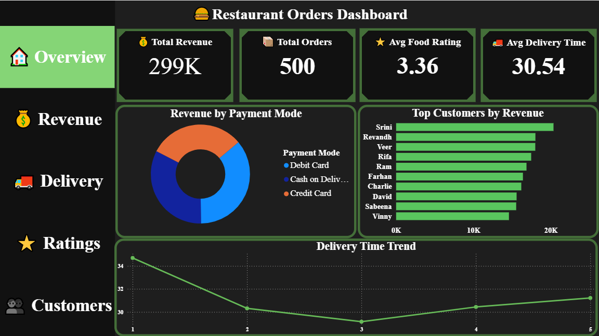
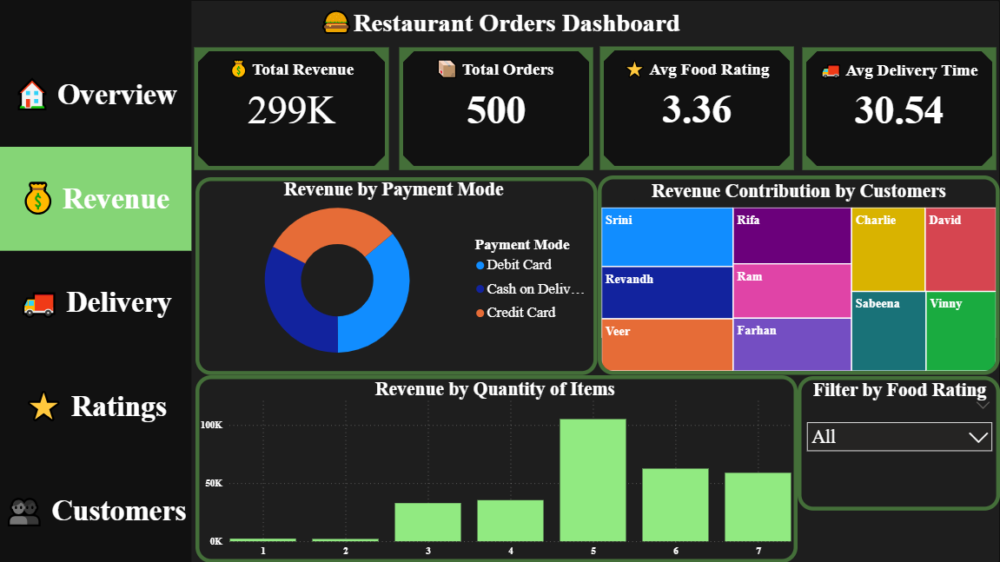
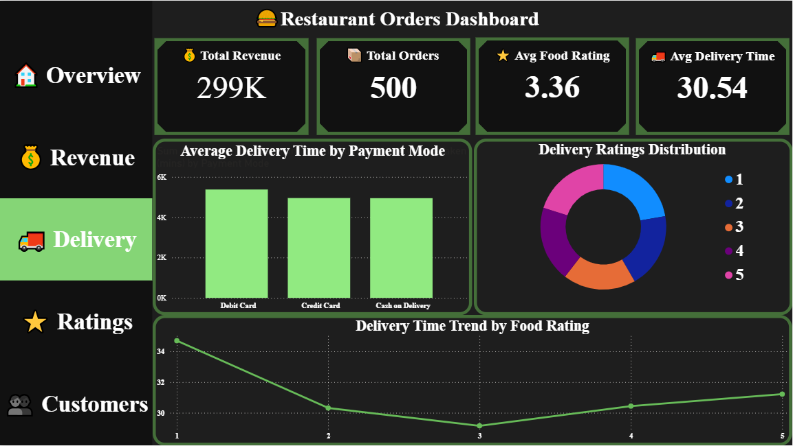
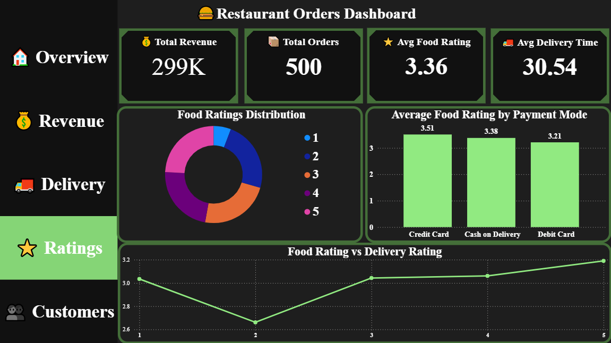
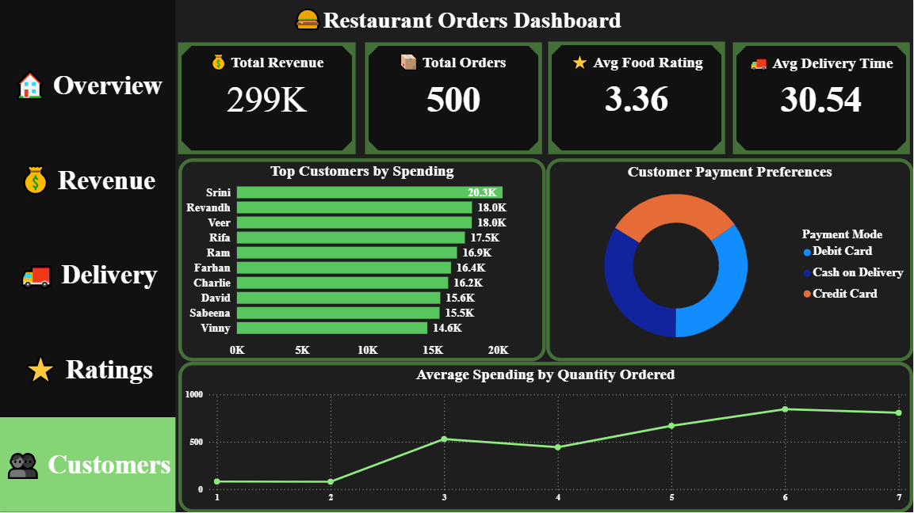

# 🍔 Restaurant Orders Analytics Dashboard

---

## 📊 Overview
This project showcases an interactive Restaurant Orders Analytics Dashboard built in Power BI using SQL-based analysis to explore revenue trends, customer behavior, delivery performance, and customer ratings.

The project combines SQL, Excel, and Power BI to transform raw restaurant order data into meaningful business insights through interactive dashboards and data storytelling.

---

## 📌 Key Metrics
- **Total Revenue:** ₹299K  
- **Total Orders:** 500  
- **Average Food Rating:** 3.36 ⭐  
- **Average Delivery Time:** 30.54 mins 🚚  

---

## 🚀 Features
- 💰 Revenue Analysis by Payment Mode  
- 👥 Top Customers by Spending  
- 🚚 Delivery Performance Analysis  
- ⭐ Food & Delivery Ratings Insights  
- 💳 Customer Payment Preferences  
- 📈 Quantity-wise Spending Trends  
- 🗄️ SQL-Based Data Analysis  
- 🎛️ Interactive Navigation & Filters  

---

## 📄 Dashboard Pages

### 🏠 Overview
- KPI Cards
- Revenue by Payment Mode
- Top Customers by Revenue
- Delivery Time Trend

### 💰 Revenue Analysis
- Revenue Contribution by Customers
- Revenue by Quantity Ordered
- Payment Insights

### 🚚 Delivery Analysis
- Average Delivery Time by Payment Mode
- Delivery Ratings Distribution
- Delivery Trends

### ⭐ Ratings Analysis
- Food Ratings Distribution
- Average Food Rating by Payment Mode
- Food Rating vs Delivery Rating

### 👥 Customers Analysis
- Top Customers by Spending
- Customer Payment Preferences
- Average Spending by Quantity Ordered

---

## 💡 Key Insights
- Debit Card generated the highest revenue  
- Top customers contributed major sales revenue  
- Better food ratings aligned with improved delivery ratings  
- Customers ordering more items spent more overall  

---

## 🛠️ Tech Stack
- Power BI
- MySQL
- Excel
- Power Query

---

## 🗂️ Dataset
Restaurant Orders Dataset containing:
- Customer Details
- Order Amount
- Food Rating
- Delivery Rating
- Delivery Time
- Payment Mode
- Quantity Ordered

---

## 🗄️ SQL Work Included
- Database Schema Creation
- Revenue Analysis Queries
- Customer Insights Queries
- Rating & Delivery Analysis
- Data Aggregation using SQL

---

## 🗄️ Sample SQL Query

*Fetches the top 5 customers based on their total spending:*

```sql
SELECT `Customer Name`,
SUM(`Order Amount`) AS TotalSpent
FROM `order`
GROUP BY `Customer Name`
ORDER BY TotalSpent DESC
LIMIT 5;
```

---

## 📷 Dashboard Preview

### 🏠 Overview Dashboard


### 💰 Revenue Analysis


### 🚚 Delivery Analysis


### ⭐ Ratings Analysis


### 👥 Customers Analysis


---

## 📄 View Full Dashboard PDF

> 📥 [**Click here to view the full Dashboard PDF**](PDF/Restaurant_Dashboard.pdf)

---

## 🎥 Dashboard Demo Video

> ▶️ [**Click here to watch the Dashboard Demo Video**](Video/restaurant-dashboard-demo.mp4)

---

## 📁 Project Structure

```text
Restaurant-Orders-Analytics
│
├── Dataset
│   └── restaurant_orders_dataset.csv
│
├── PDF
│   └── Restaurant_Dashboard.pdf
│
├── Power-BI
│   └── Restaurant_Dashboard.pbix
│
├── SQL
│   ├── restaurant_analysis_queries.sql
│   └── restaurant_database_schema.sql
│
├── Screenshots
│   ├── overview-dashboard.png
│   ├── revenue-analysis.png
│   ├── delivery-analysis.png
│   ├── ratings-analysis.png
│   └── customers-analysis.png
│
├── Video
│   └── restaurant-dashboard-demo.mp4
│
└── README.md
```

---

## 📂 Included Files
- Power BI Dashboard (.pbix)
- SQL Queries
- Database Schema
- Dashboard PDF
- Dashboard Demo Video
- Dataset File

---

## 💼 Business Use Case
This dashboard helps restaurants:
- Track revenue performance
- Analyze customer behavior
- Improve delivery efficiency
- Understand customer preferences
- Monitor ratings & service quality

---

## ▶️ How to Use
1. Download the `.pbix` file  
2. Open it using Power BI Desktop  
3. Explore different dashboard pages  
4. Use filters and navigation buttons for interaction  

---

## 👤 Author

**Moin Ahmed**  
🎓 BSc IT Final Year Student  
📊 Aspiring Data Analyst  

🔗 GitHub: https://github.com/Moin-27